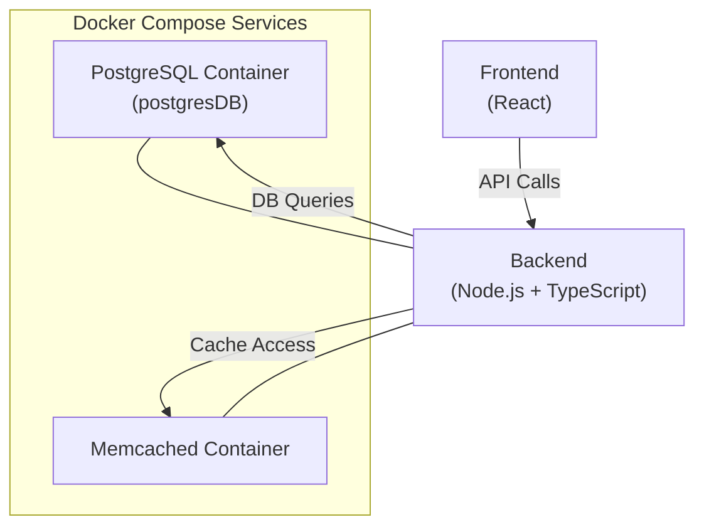

# CodeGenitor

```mermaid
graph TD
    subgraph "Docker Compose Services"
        DB["PostgreSQL Container\n(postgresDB)"]
        MC["Memcached Container"]
    end

    BE["Backend\n(Node.js + TypeScript)"]
    FE["Frontend\n(React)"]

    FE -- "API Calls" --> BE
    BE -- "DB Queries" --> DB
    BE -- "Cache Access" --> MC

    %% Networks (for conceptual clarity)
    DB --- BE
    BE --- MC
```
